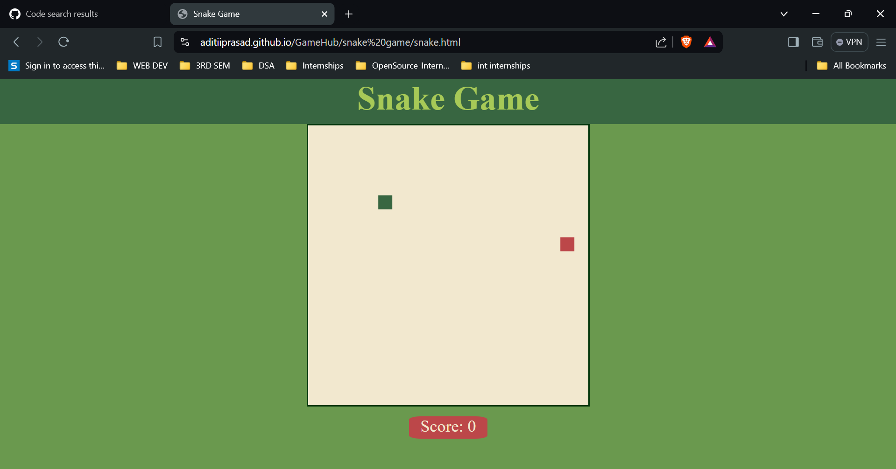
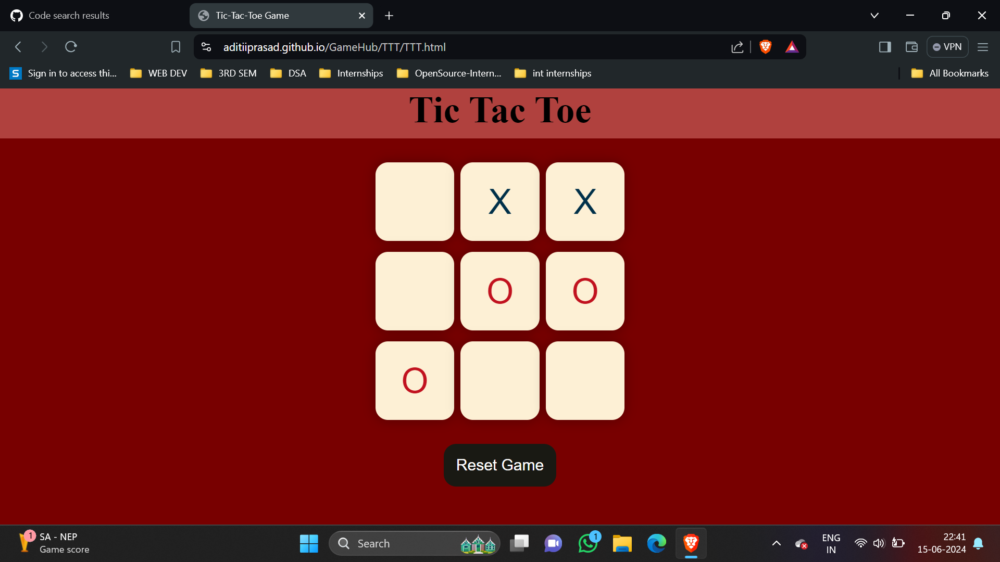
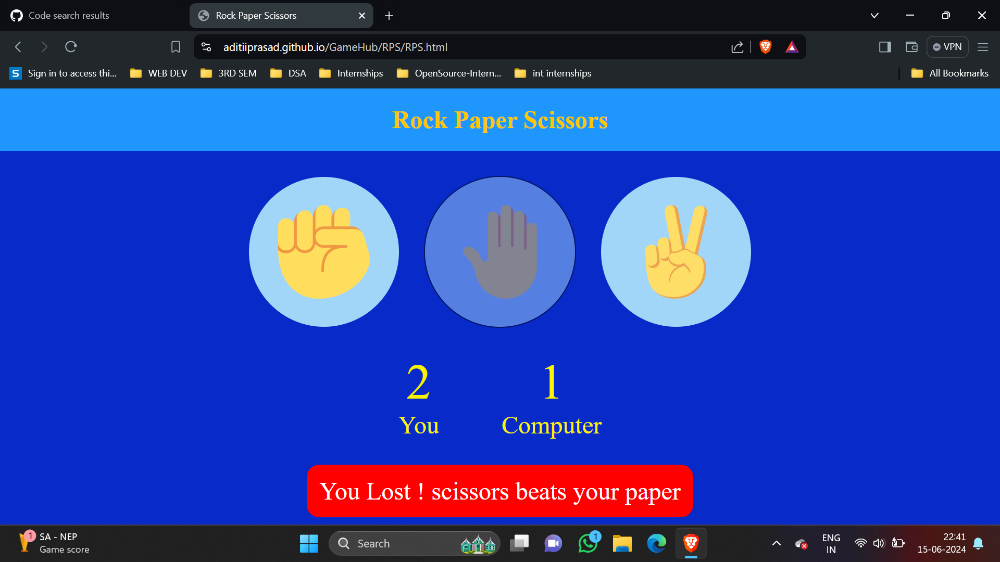
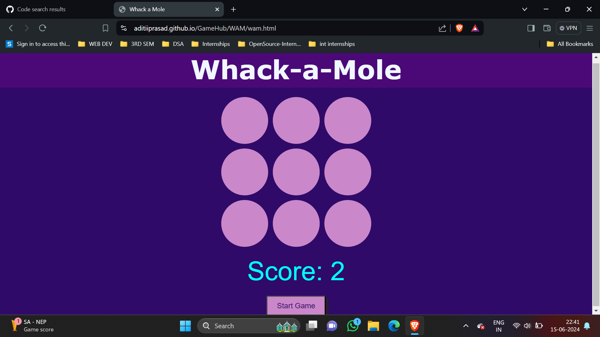

<p align="center">
 
</p>
<a href="https://aditiiprasad.github.io/GameHub/">  </a> <b>Click this icon to view Project<b>

[](https://git.io/typing-svg)


# 1. Snake Game

```

Control a snake to eat food and grow longer, but avoid running into walls or the snake's own body.

```

<a href="https://aditiiprasad.github.io/GameHub/snake%20game/snake.html">  </a>

# 2. Tic Tac Toe
 
```

A classic two-player game where players take turns marking a 3x3 grid with Xs and Os. The first player to get three in a row wins.

```
<a href="https://aditiiprasad.github.io/GameHub/TTT/TTT.html">  </a>


# 3. Rock Paper Scisssors
 
 ```
A simple game where players choose rock, paper, or scissors and play against the computer to see who wins.

 ```
 <a href="https://aditiiprasad.github.io/GameHub/RPS/RPS.html">  </a>


# 4. Whack a mole

```

Moles pop up randomly from holes, and players must click on them to score points before they disappear.

```
<a href="https://aditiiprasad.github.io/GameHub/WAM/wam.html">  </a>


# WEB DEV DIARIES (14/06/2024)
<h4>
 1. Made a mini games website after learning JAVASCRIPT. This is my first project using JS.
 
</h4>
 <h4>2.LEARNINGS-
 <BR>
  JavaScript enabled interactive game controls and user engagement.
    <BR>
Dynamic content management improved site performance.
    <BR>
Event handling and DOM manipulation facilitated seamless game functionalities.
  <BR>

 Clean coding emphasized for an appealing interface & practical front-end experience.
 
 </H4>

